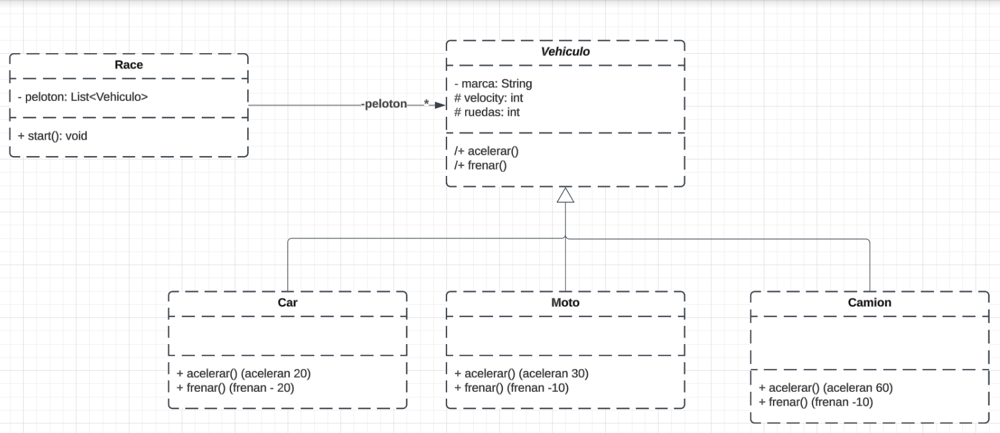

🚗 Proyecto de Herencia en Java: Vehículo, Coche, Moto y Camión 🚛
Este proyecto demuestra cómo utilizar la herencia en Java para modelar diferentes tipos de vehículos y simular una carrera entre ellos. Contiene una clase base Vehiculo y tres clases derivadas (Coche, Moto, y Camion), junto con una clase Race que organiza y ejecuta la carrera entre estos vehículos.

📜 Descripción de las Clases
Vehiculo 🚘
La clase base Vehiculo define los atributos y métodos comunes para todos los vehículos, como la marca, velocity (velocidad) y el número de ruedas. También tiene métodos como acelerar() y frenar().

Atributos principales:
marca: Marca del vehículo (ej. Toyota, Yamaha).
velocity: Velocidad actual del vehículo.
ruedas: Número de ruedas del vehículo.
Coche 🚗
La clase Coche hereda de Vehiculo y representa un coche. En su implementación de acelerar() y frenar(), el coche incrementa o reduce la velocidad en 20 unidades.

Moto 🏍️
La clase Moto también hereda de Vehiculo y representa una motocicleta. En su implementación de acelerar() y frenar(), la moto incrementa la velocidad en 30 unidades y la reduce en 10 unidades.

Camion 🚛
La clase Camion hereda de Vehiculo y representa un camión. Puedes personalizar el comportamiento de acelerar() y frenar() según las características propias de los camiones.

Race 🏁
La clase Race organiza y gestiona una carrera entre los vehículos. Recibe una lista de vehículos (peloton) y, al llamar a su método start(), se inicia la carrera en la que cada vehículo acelera y se muestra su estado actual.

⚙️ Ejecución del Código
La clase Main crea instancias de Camion, Coche, y Moto, y los agrupa en una lista peloton. Luego, inicializa la clase Race con esta lista y llama al método start() para simular la carrera.

java
Copiar código
package org.example;

import herencias.Camion;
import herencias.Coche;
import herencias.Moto;
import herencias.Vehiculo;
import herencias.Race;
import java.util.List;

public class Main {
public static void main(String[] args) {
System.out.println("hello");
List<Vehiculo> peloton = List.of(new Camion("Camion"), new Coche("Coche"), new Moto("Moto"));

        startRace(peloton);

        Race race = new Race(peloton);
        race.start();
    }

    public static void startRace(List<Vehiculo> peloton) {
        for (Vehiculo vehiculo : peloton) {
            vehiculo.acelerar();
            System.out.println(vehiculo);
        }
    }
}
🔍 Resultado Esperado
Al ejecutar el programa, deberías ver una salida similar a esta:

plaintext
Copiar código
hello
Camion: Velocidad tras acelerar
Coche: Velocidad tras acelerar
Moto: Velocidad tras acelerar
...
🛠️ Tecnologías Utilizadas
Java ☕
JDK 11 o superior

📝 Notas
Asegúrate de compilar cada archivo .java en la estructura de carpetas correcta. Para ejecutar Main.java, debes tener todas las clases en su paquete correspondiente.
